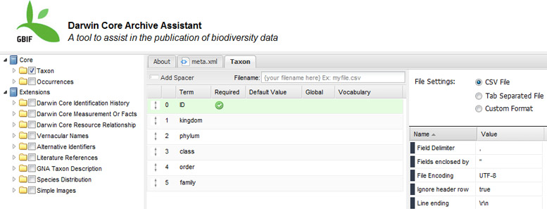

The Darwin Core is body of standards for sharing biodiversity information that include a set of terms, and recommendations on how to package and document them to facilitate data publication and sharing.   One recommendation defines a simple, text-based, exchange format.   A requirement of this format is an XML document, called a "metafile", that serves to describe the physical format and arrangement of published files.

This project provides a simple web application for data managers to use in order to generate and validate this metafile.  See the [scoping document](GBIF-MetaMaker-Scoping.pdf) for this project.

Migrated from [Google Code](https://code.google.com/archive/p/gbif-meta-maker/).
